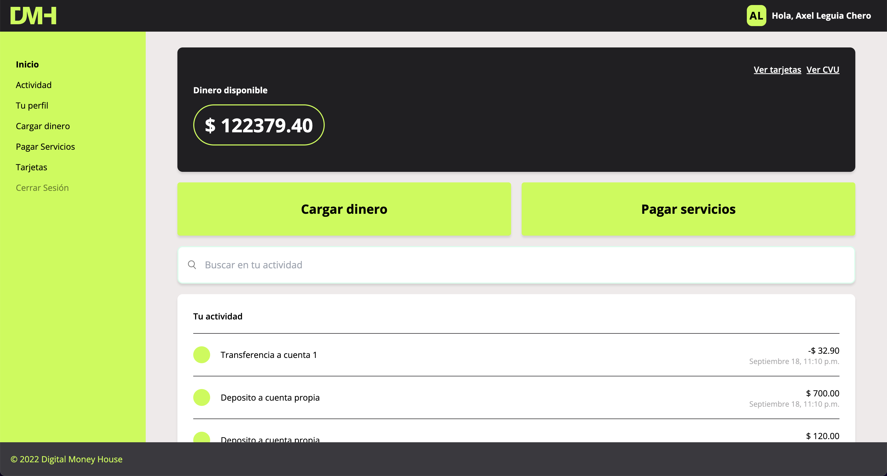
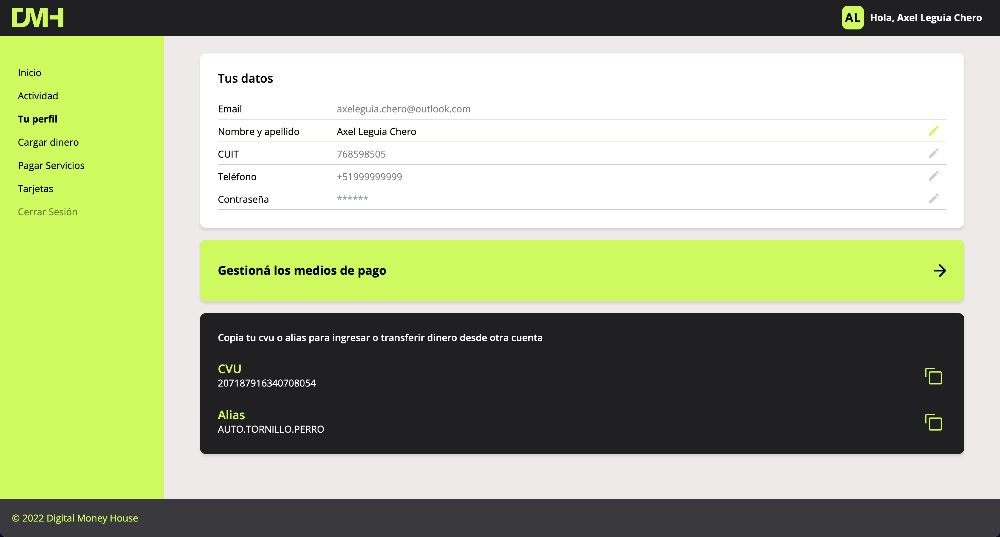

## Prerequisites

- Node.js
- Docker

## Installation

```bash
npm install
```

## Running the redis server

Run the docker-compose file to start the redis server

```bash
docker-compose up
```

## Running the server

```bash
npm run dev
```

## Development server

Open [http://localhost:3000](http://localhost:3000) with your browser to see the result.

You can start editing the page by modifying `app/page.tsx`. The page auto-updates as you edit the file.



